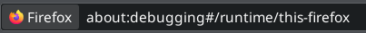
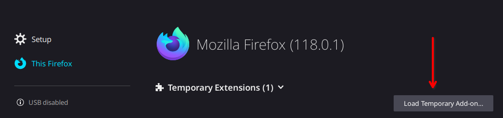
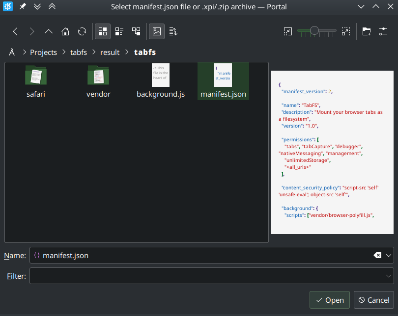
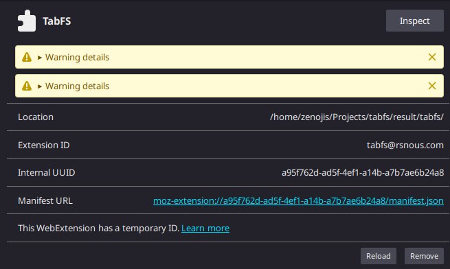
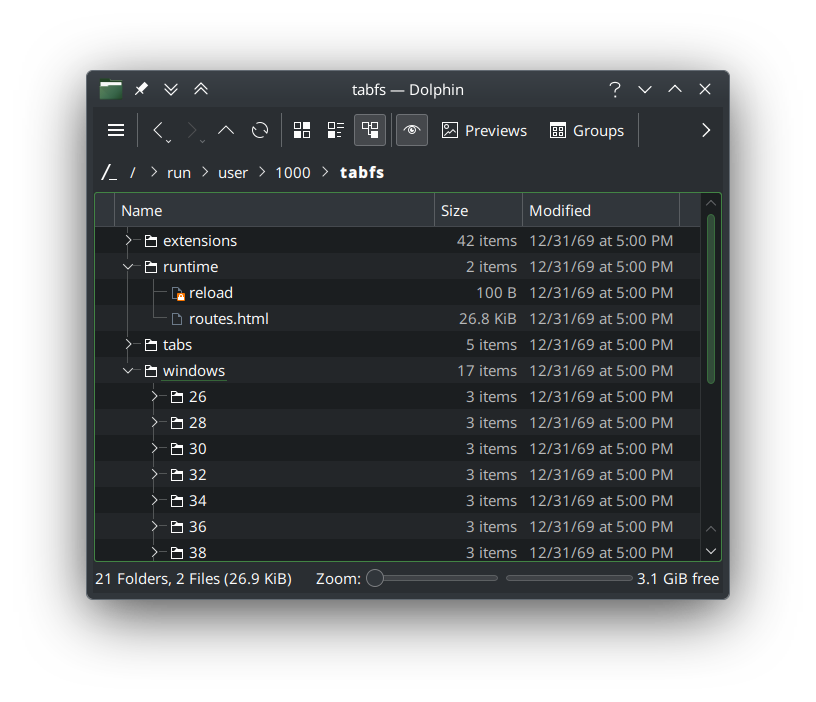

# tabfs-nix
Nix Flake for TabFS Browser Extension

Original source code at [https://github.com/osnr/TabFS](https://github.com/osnr/TabFS). This flake makes no modification or copy of @osnr's code.

___

## Building
### Building from local clone
    git clone https://github.com/chasevasic/tabfs-nix
    cd tabfs-nix
    nix build .

### Building from github
    nix build github:chasevasic/tabfs-nix

___

## Installing
### Native messaging host
#### Firefox
     result/bin/tabfs-install-native-messaging-host firefox

### Extension
See: [https://omar.website/tabfs/#1-install-the-browser-extension](https://omar.website/tabfs/#1-install-the-browser-extension)

#### Firefox
Note: without signing the addon it can only be installed temporarily. These instructions are for a temporary installation that lasts only one session.

1. 
2. 
3. 
4. 
5. 

## Usage
Open your file browser and navigate to /run/user/1000/tabfs (replace 1000 with your uid)

Read official instructions at: [https://omar.website/tabfs/](https://omar.website/tabfs/)

## Notes
- Due to limitations involving extension signing and installation on Nix, it is not recommended that this is included in a NixOS system flake (or configuration.nix). There is nothing stopping you from doing so, but the point is somewhat defeated by the necessary manual steps of installing the extension and native messaging host. Theoretically, home-manager can probably overcome the issues, but I do not and will not use home-manager. This flake is, however, a starting point for a completely declarative flake or derivation
- The mount path can only be changed by editing `flake.nix`. This is a limitation in the original tabfs browser extension code. Technically `tabfs.c` reads the mount path from `$TABFS_MOUNT_DIR` but this is not passed from the native messaging host plugin, meaning it is not configurable. Without the environment variable, it defaults to `mnt` in the working directory of the launching application. On Nix, this is most likely a read-only directory. My solution was to wrap `tabfs` with `TABFS_MOUNT_DIR` set to `/run/user/$(id -u)/tabfs` in the Nix derivation.